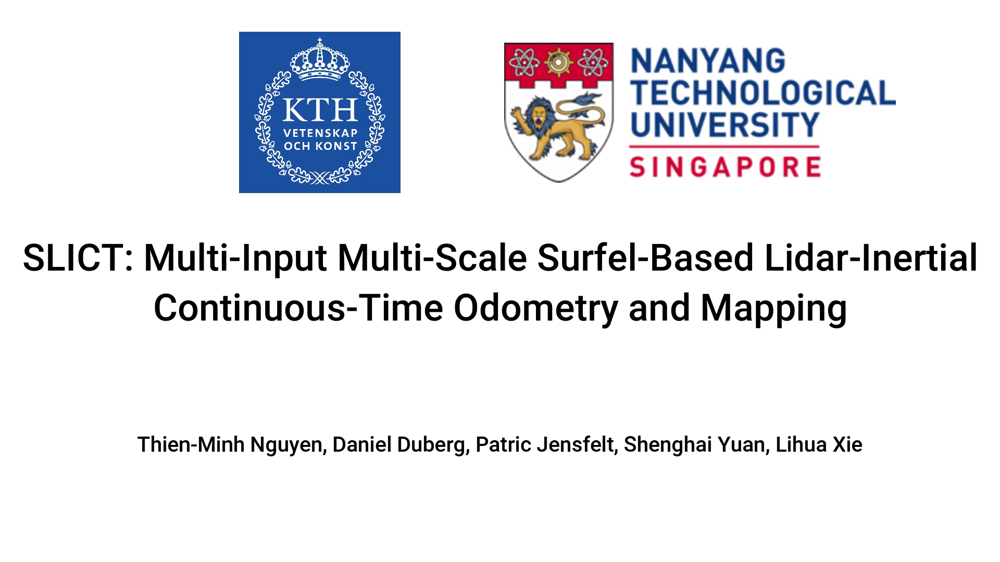
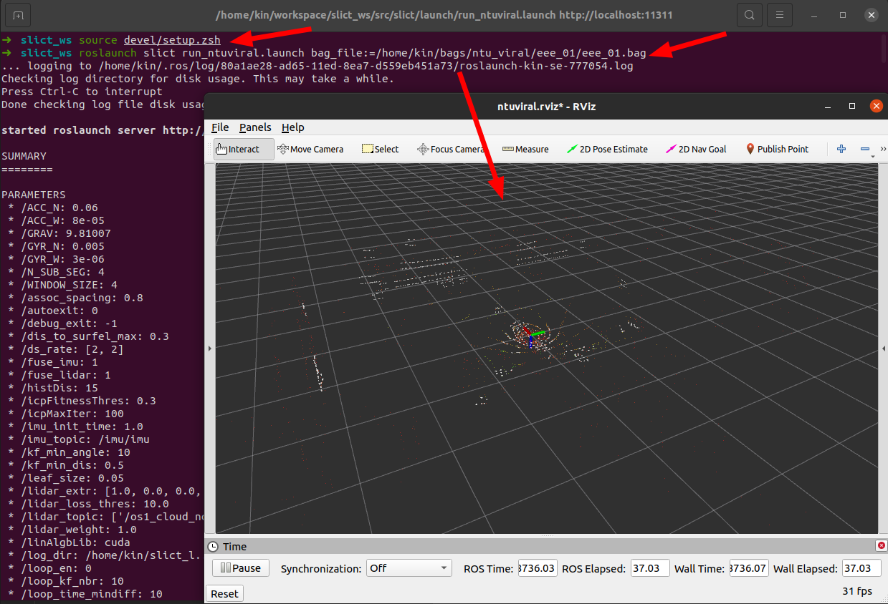
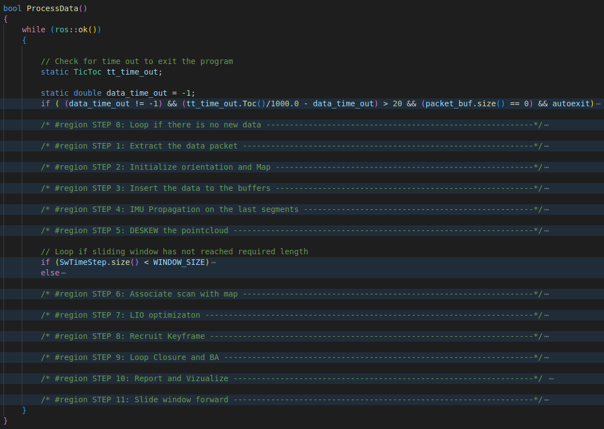
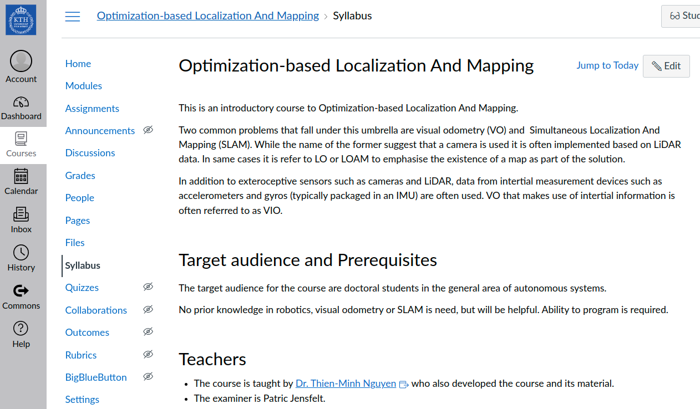

SLICT: Multi-Input, Multi-Scale, Efficient, Surfel-Based, Lidar-Inertial Continuous-Time Odometry and Mapping, with Internal Association
===

Note: This is an actively developed repo. The stable versions are listed at https://github.com/brytsknguyen/slict/tags.

# Publication
The details of SLICT are presented in two RA-L papers. Please cite these works if you find SLICT useful:

```
@article{nguyen2023slict,
  title         = {SLICT: Multi-input Multi-scale Surfel-Based Lidar-Inertial Continuous-Time Odometry and Mapping},
  author        = {Nguyen, Thien-Minh and Duberg, Daniel and Jensfelt, Patric and Yuan, Shenghai and Xie, Lihua},
  journal       = {IEEE Robotics and Automation Letters},
  volume        = {8},
  number        = {4},
  pages         = {2102--2109},
  year          = {2023},
  publisher     = {IEEE}
}
```

```
@article{nguyen2024eigen,
  title         = {Eigen Is All You Need: Efficient Lidar-Inertial Continuous-Time Odometry With Internal Association}, 
  author        = {Nguyen, Thien-Minh and Xu, Xinhang and Jin, Tongxing and Yang, Yizhuo and Li, Jianping and Yuan, Shenghai and Xie, Lihua},
  journal       = {IEEE Robotics and Automation Letters}, 
  year          = {2024},
  volume        = {9},
  number        = {6},
  pages         = {5330-5337},
  doi={10.1109/LRA.2024.3391049}
}
```


# Summary

## SLICT 1:
(Please checkout the tag [slict.1.0](https://github.com/brytsknguyen/slict/releases/tag/slict.1.0))
<div align="center">
    <a href="https://youtu.be/mogIgBq97Hs" target="_blank">
    
</div>

[arxiv](https://arxiv.org/abs/2211.03900)
[RA-L](https://ieeexplore.ieee.org/document/10048526)

## SLICT 2 (current commit):

Upgrades to using B-spline for trajectory representation, knot length as small as 0.01s, with an efficient solver that ensures real-time performance.
More details can be find at our [RA-L paper](https://ieeexplore.ieee.org/document/10504969).


# Build & Run

## Prerequisites

The software was developed on the following dependencies. Ubuntu 20.04 and ROS Noetic is a must for compiling SLICT due to UFOMap's [minimum requirement](https://github.com/UnknownFreeOccupied/ufomap/wiki/Setup#installation). However **<u>a docker</u>** can be used to run SLICT with older OS versions. Please find the instructions below.
- [Ubuntu 20.04](https://releases.ubuntu.com/20.04/) with [ROS Noetic](http://wiki.ros.org/noetic/Installation)

- [Ceres 2.1.0](http://ceres-solver.org/installation.html) (or older, if you use later versions you may encounter [this error](https://github.com/brytsknguyen/slict/issues/2#issuecomment-1431686045))

    ```bash
    git clone https://ceres-solver.googlesource.com/ceres-solver
    cd ceres-solver && git fetch --all --tags
    git checkout tags/2.1.0
    mkdir build && cd build
    cmake .. && make -j$(nproc)
    sudo make install
    ```
- Sophus
  ```bash
  git clone https://github.com/strasdat/Sophus
  cd Sophus
  mkdir build && cd build
  cmake .. -DSOPHUS_USE_BASIC_LOGGING=ON
  make -j$(nproc)
  sudo make install
  ```
- One more package:

    ```
    sudo apt install ros-$ROS_DISTRO-tf2-sensor-msgs
    ```

## Installation

SLICT uses UFOMap for global map management. It also supports epicyclic lidar (Livox). Thus, three packages need to be included in the catkin workspace:

1. [SLICT](https://github.com/brytsknguyen/slict)
2. [UFOMap (devel_surfel)](https://github.com/brytsknguyen/ufomap/tree/devel_surfel)
3. To compile the package for use with livox lidars (avia, mid-70, mid 360), you need to install [Livox ROS driver (forked)](https://github.com/brytsknguyen/livox_ros_driver) and [Livox ROS driver2 (forked)](https://github.com/brytsknguyen/livox_ros_driver2) (you need to install [LIVOX-SDK](https://github.com/Livox-SDK/Livox-SDK) and [LIVOX-SDK2](https://github.com/Livox-SDK/Livox-SDK2))

Please install all dependencies first. Afterwards, create a ros workspace, clone the packages to the workspace, and build by `catkin build` or `catkin_make`, for e.g.:

```
mkdir -p slict_ws/src
cd slict_ws/src
git clone https://github.com/brytsknguyen/slict
git clone https://github.com/brytsknguyen/ufomap && cd ufomap && git checkout devel_surfel && cd ..
git clone https://github.com/brytsknguyen/livox_ros_driver
git clone https://github.com/brytsknguyen/livox_ros_driver2
cd .. && catkin build
```
The launch files for NTU VIRAL, Newer College, MCD VIRAL, and FusionPortable are provided under `launch`

Please raise an issue if you encounter any problem.

## Example

After build step success, run following commands:

```bash
source devel/setup.zsh # Or make this command automatic by: echo "source /home/$USER/slict_ws/devel/setup.bash" >> ~/.bashrc"
roslaunch slict run_mcdviral.launch bag_file:=${PATH_TO_THE_MCD_SEQ}
# Example: roslaunch slict run_mcdviral.launch bag_file:=/media/tmn/mySataSSD1/DATASETS/MCDVIRAL/PublishedSequences/ntu_day_01/*.bag
```
<!-- <p align="center">

</p> -->

You can also modify the path 

<!-- # Docker User

## Precompiled Image

To use SLICT on any platform without compiling issues, we prepare a [docker image](https://hub.docker.com/repository/docker/brytsknguyen/slict-noetic-focal/general) with all things precomiled.

First, please install docker engine using the instructions at https://docs.docker.com/engine/install .

Once done, pull this repo into your workspace, then build (ignore error), and `source devel/setup.sh` to update the path to packages. For e.g.
    
```
mkdir catkin_ws/src
cd catkin_ws/src
git clone https://github.com/brytsknguyen/slict
catkin build                                        # there may be error
source ../devel/setup.bash                          # now SLICT's path is set
```

Now we can just call the scripts under `docker` for the corresponding dataset. For example you can run SLICT with an NTU VIRAL sequence by

```
roscd slict/docker && ./run_ntuviral.sh /path/to/dataset
```

You can also set a default /path/to/dataset in the script `run_ntuviral.sh` at [this line](https://github.com/brytsknguyen/slict/blob/877cad94b209be94defd6a7c578bd55b349d1024/docker/run_ntuviral.sh#L6).

To change between the sequence, simply change the `bag_file` argument in the [launch file](https://github.com/brytsknguyen/slict/blob/877cad94b209be94defd6a7c578bd55b349d1024/launch/run_ntuviral.launch#L23).

## Recompile SLICT on local container

For advance users who wants to test your changes to SLICT on the local container, simply build one with the provided docker file:

```
roscd slict/docker && make build  # Container is named slict-noetic-focal
```

Afterwards, you can remove the [repository reference](https://github.com/brytsknguyen/slict/blob/877cad94b209be94defd6a7c578bd55b349d1024/docker/run_ntuviral.sh#L7) `brytsknguyen` in the script to use the local container `slict-noetic-focal` -->

# Learning SLAM?

SLICT was developed with intention to keep things educational.The whole backbone of the program is in the following steps:

<p align="center">

</p>

Parts of SLICT were used in the course "Optimization-Based Localization and Mapping" at Division of Robotics, Perception and Learning, KTH Royal Institute of Technology (http://kth-rpl.se/). The course is open to public at the following [OBLAM Course Site](https://canvas.kth.se/courses/40649).

<p align="center">

</p>

<p align="center">

</p>
