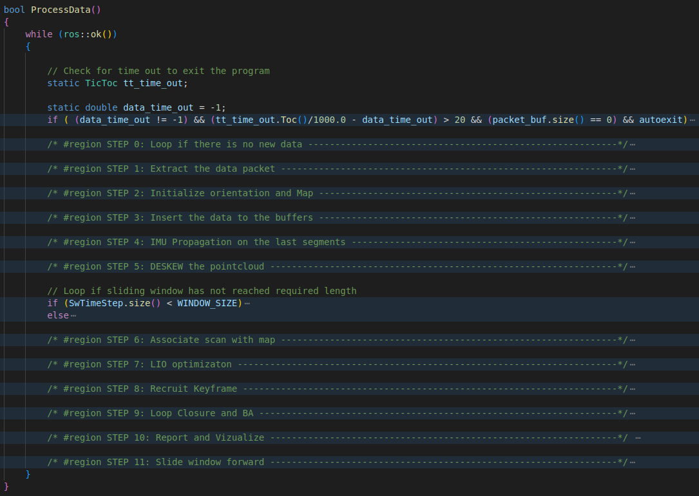
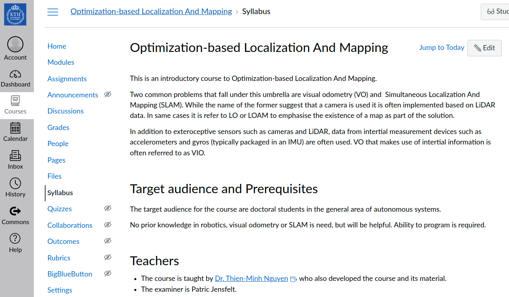

SLICT: Multi-Input, Multi-Scale, Efficient, Surfel-Based, Lidar-Inertial Continuous-Time Odometry and Mapping, with Internal Association
===

The current version runs on Ubuntu 24.04, ROS 2 Jazzy. More details on the instruction below.

For the SLICT 2 at ROS 1 version, please checkout the [**noetic** tag](https://github.com/brytsknguyen/slict/releases/tag/noetic).
For the SLICT 1 at ROS 1 version, please checkout the [**slict.1.0** tag](https://github.com/brytsknguyen/slict/releases/tag/slict.1.0).

# Publication
The details of SLICT are presented in two RA-L papers. Please cite these works if you find SLICT useful:

```
@article{nguyen2023slict,
  title         = {SLICT: Multi-input Multi-scale Surfel-Based Lidar-Inertial Continuous-Time Odometry and Mapping},
  author        = {Nguyen, Thien-Minh and Duberg, Daniel and Jensfelt, Patric and Yuan, Shenghai and Xie, Lihua},
  journal       = {IEEE Robotics and Automation Letters},
  volume        = {8},
  number        = {4},
  pages         = {2102--2109},
  year          = {2023},
  publisher     = {IEEE}
}
```

```
@article{nguyen2024eigen,
  title         = {Eigen Is All You Need: Efficient Lidar-Inertial Continuous-Time Odometry With Internal Association}, 
  author        = {Nguyen, Thien-Minh and Xu, Xinhang and Jin, Tongxing and Yang, Yizhuo and Li, Jianping and Yuan, Shenghai and Xie, Lihua},
  journal       = {IEEE Robotics and Automation Letters}, 
  year          = {2024},
  volume        = {9},
  number        = {6},
  pages         = {5330-5337},
  doi={10.1109/LRA.2024.3391049}
}
```

# Build & Run

## Prerequisites

The software was developed on the following dependencies:

- [Ubuntu 24.04](https://releases.ubuntu.com/24.04)
  
- [ROS Jazzy](https://docs.ros.org/en/jazzy/index.html)
  
- [Ceres 2.2.0](http://ceres-solver.org/installation.html)

Please have these dependencies installed before compile SLICT.

## Installation

SLICT uses UFOMap for global map management. It also supports epicyclic lidar (Livox). Thus, three packages need to be included in the catkin workspace:

1. [SLICT](https://github.com/brytsknguyen/slict)
2. [UFOMap (devel_surfel)](https://github.com/brytsknguyen/ufomap/tree/devel_surfel)
3. To compile the package for use with livox lidars (avia, mid-70, mid 360), you need to install [Livox ROS driver 2](https://github.com/brytsknguyen/livox_ros_driver2)

Please install all dependencies in the prerequisites first. Afterwards, create a ros workspace (for e.g. `slict_ws`), clone the packages to the workspace, and build by `colcon build --symlink-install`.

The launch files for NTU VIRAL, Newer College, MCD VIRAL, and FusionPortable are provided under `launch`

Please raise an issue if you encounter any problem.

## Example

After the build step success, modify the path to the data sequence in the launch file, for example in run_mcdviral.launch.py it is currently set as:


Then run the following commands:

```
cd slict_ws                                # Change directory to the root of the slict workspace
source install/setup.bash                  # Source all the definitions of the workspace
ros2 launch slict run_mcdviral.launch.py   # Launch slict with settings for the mcdviral dataset. Note: the dataset is in ROS 1 format, you need to convert it to ROS 2.
```

# Learning SLAM?

SLICT was developed with intention to keep things educational.The whole backbone of the program is in the following steps:

<p align="center">

</p>

Parts of SLICT were used in the course "Optimization-Based Localization and Mapping" at Division of Robotics, Perception and Learning, KTH Royal Institute of Technology (http://kth-rpl.se/). The course is open to public at the following [OBLAM Course Site](https://canvas.kth.se/courses/40649).

<p align="center">

</p>

<p align="center">

</p>
